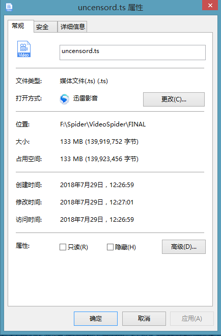

# python爬虫m3u8合并成mp4格式

# 环境

python3

# 爬虫工具

依旧采用了requests+BeautfulSoup的组合。request负责采集网络信息，BeautifulSoup负责进行信息处理

# 目的 

该小项目的主要目的是熟悉python语言，练习网络爬虫的使用，无其他目的<br/>
<br/>

选取该网站的原因主要是考虑到这类网站对于视频的保护措施相对较弱。尝试解析过国内视频网站（如爱奇艺、优酷）等网站，受到会员制度等各种限制，抓取难度较大， 因此暂时采用该网站进行采集训练。
<br/>
<br/>
在代码中已经将相应url删除
<br/>
<br/>
测试过程中IP被封锁，不得不使用了动态代理，问题驱动是最好的实践。

# 安装依赖与运行

```code
pip install requests
pip install lxml

python main.py

```

# 效果图


